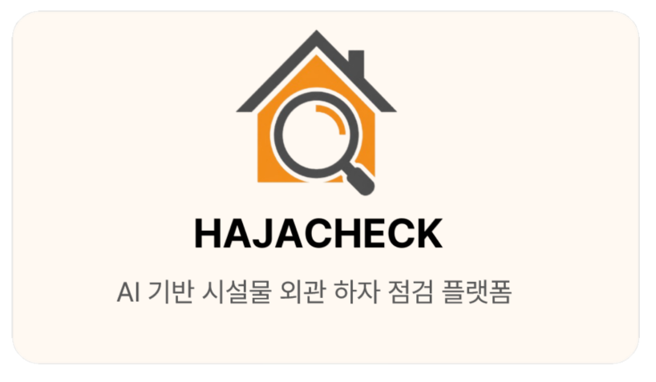
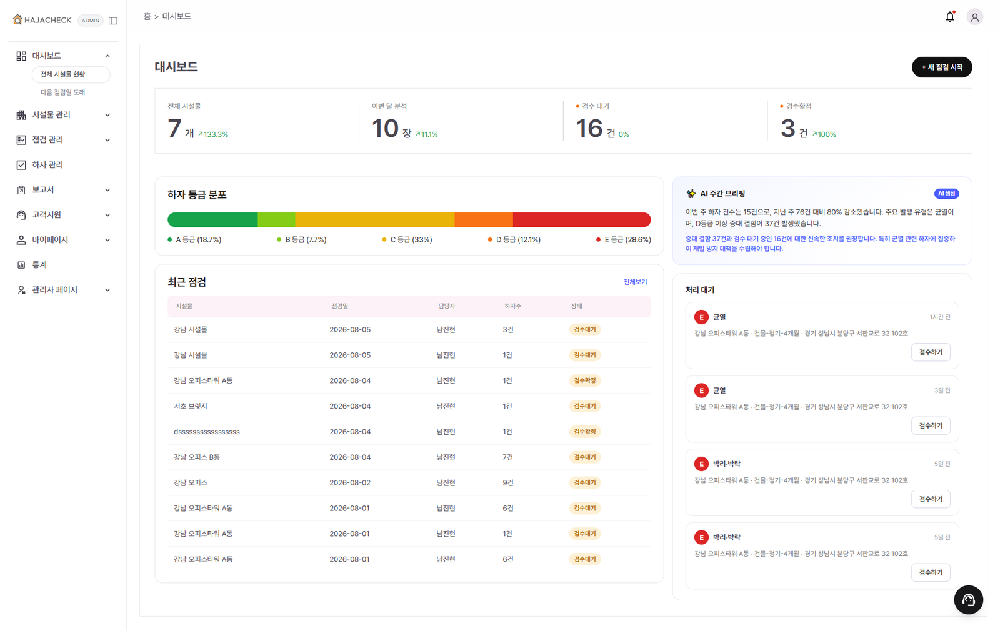
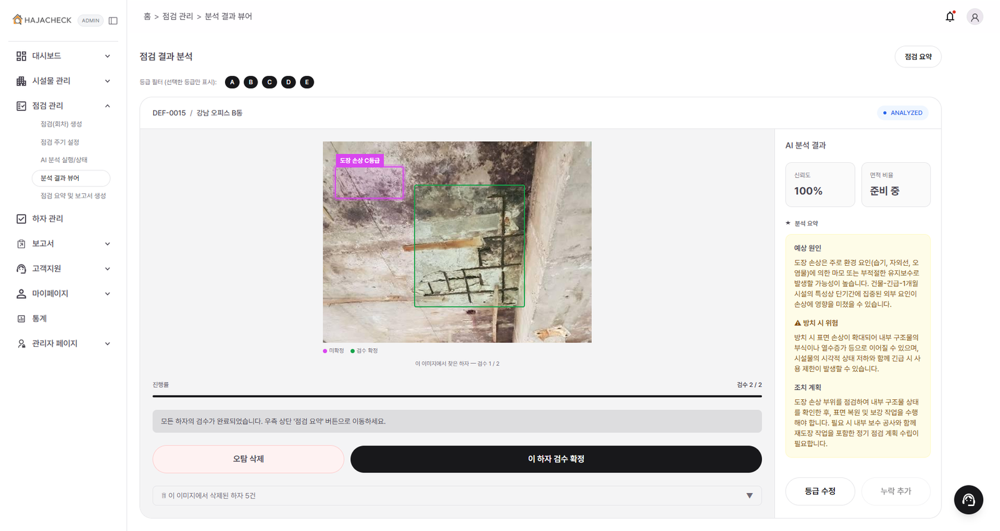
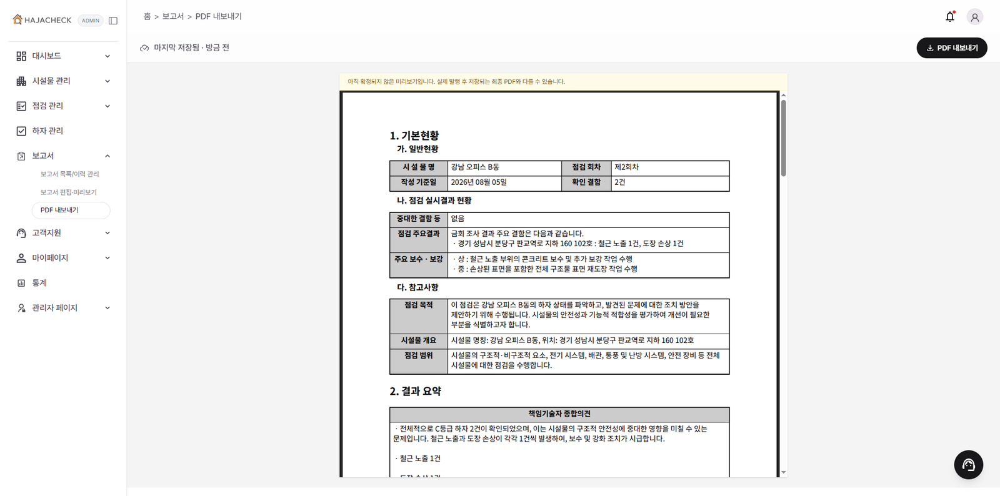
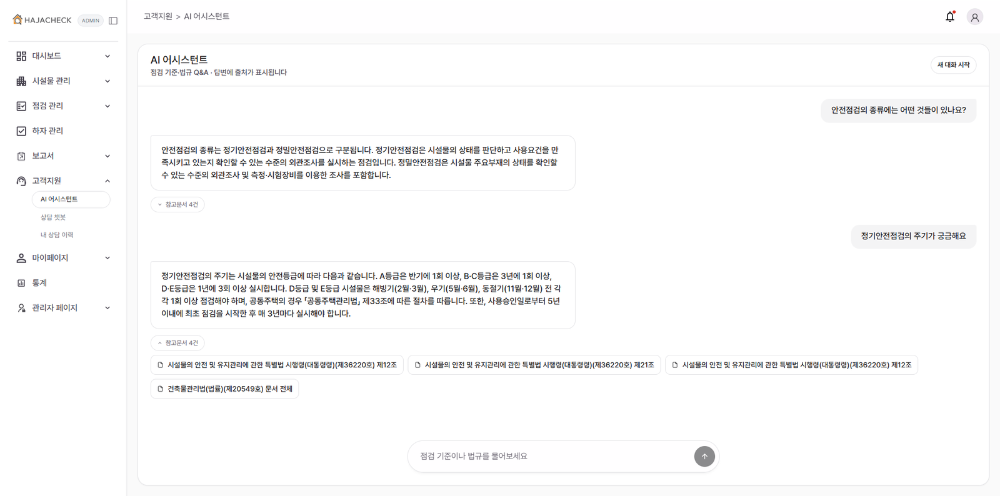
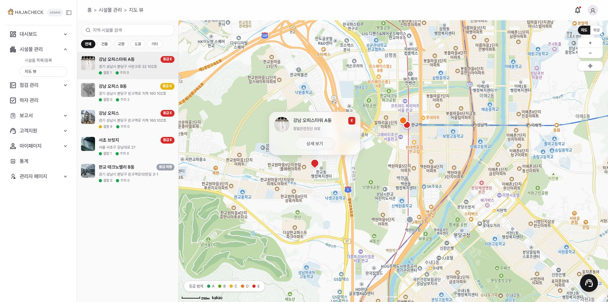
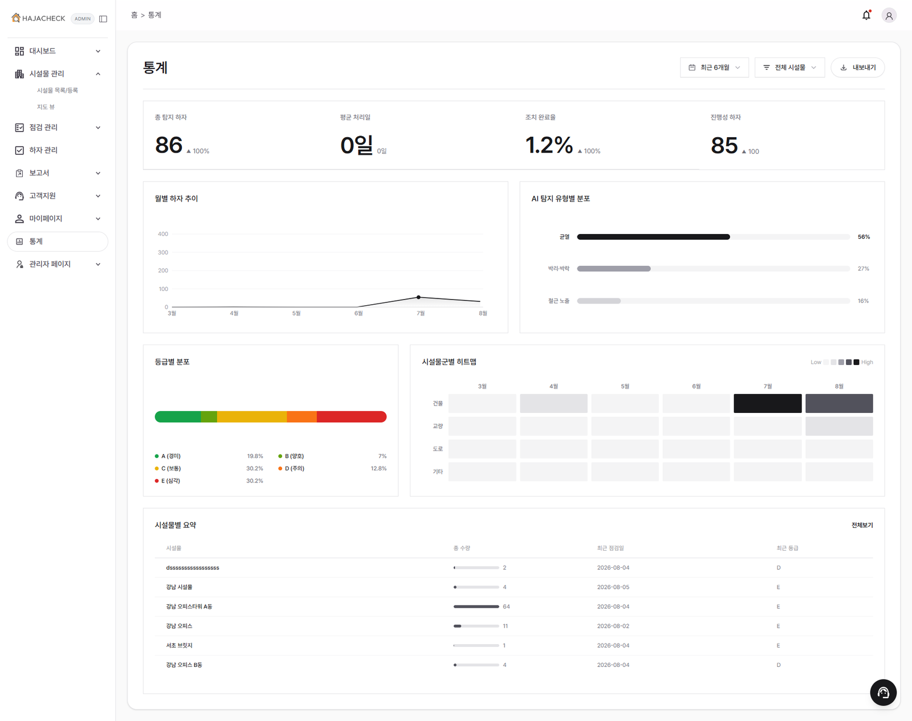
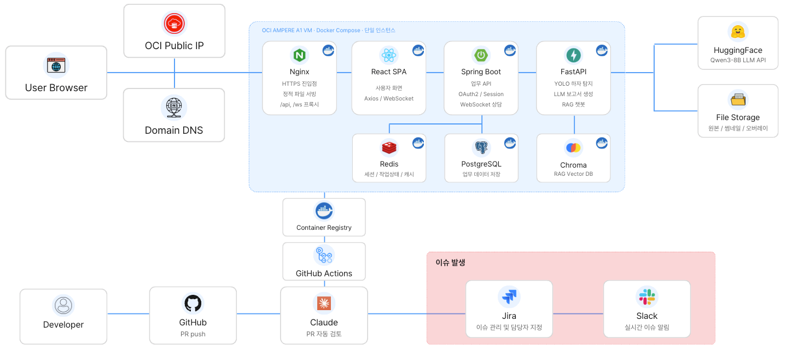

<div align="center">



**사진을 올리면 하자를 찾고, 등급을 매기고, 보고서 초안까지 씁니다.**

시설물(건물 외벽·교량 등) 사진을 업로드하면 유형별 전용 Vision 모델(균열 U-Net · 면적형 YOLO)이
균열·박리박락·철근노출을 탐지하고, 규칙 기반으로 A~E 등급을 매긴 뒤
LLM(LangChain + RAG)이 점검 보고서 초안과 법규 질의응답까지 지원합니다.

[]()
[]()
[]()
[]()
[]()
[]()

🚀 **[라이브 데모](https://hajacheck.luma200ok.com)** · 🎬 **[시연 영상](https://youtu.be/IagMc_vZxpA)** · 📑 **[최종보고서(PDF)](docs/report/hajaCheck%20최종보고서_final.pdf)** · 📋 **[진행 보드](docs/STATUS.md)**

</div>

---

## 📌 프로젝트 정보

|  |  |
|---|---|
| **프로젝트명** | HajaCheck (하자체크) |
| **개발 기간** | 2026.07.09 ~ 08.07 (4주) |
| **팀 구성** | AI 심화 과정 8인 팀 — 메뉴 담당제(전원 화면+API+AI 연동 직접 구현) |
| **핵심 개념** | 사진 업로드 → AI 하자 탐지 → 등급 산정 → 휴먼 검수 → LLM 보고서 초안 |
| **개발 규모** | 32일간 **PR 712건 머지**(PR머신 자동 검수·머지 492건) · 자동화 테스트 **4,550개** · API **97 operation** |
| **배포** | OCI(자체 서버) Docker Compose + nginx — [hajacheck.luma200ok.com](https://hajacheck.luma200ok.com) · main 승격 시 CD 자동배포 |

---

## 👥 팀원 & 역할

> AI 심화 과정 **8인 팀 프로젝트** · 2026.07.09 ~ 08.07 · 메뉴 담당제(전원 화면+API+AI 연동)

| 🧑‍💻 김승현 (PM) | 🧑‍💻 정재봉 (PL) | 🧑‍💻 유병현 | 🧑‍💻 오영석 |
|:---|:---|:---|:---|
| └ PRD·아키텍처 설계, 일정·산출물 관리<br>└ 관리자 페이지 개발<br>└ RAG(검색) 코치 | └ 로그인·회원가입(OCR) 개발<br>└ DevOps 리드 — OCI 인프라·CI/CD<br>└ 공용 DB·배포 운영 | └ DB 스키마 기초 설계<br>└ 하자 관리 + 통계 개발<br>└ 데이터(DB·API 계약) 오너 | └ 점검 관리 B — 결과 뷰어·검수<br>└ 검수 API + AI 하자 설명<br>└ LLM(생성) 코치 |
| **🧑‍💻 이은석** | **🧑‍💻 허남** | **🧑‍💻 김관영** | |
| └ 고객지원 개발 · 실시간(상담) 오너<br>└ RAG 챗봇 파이프라인<br>└ STOMP 서버·인증·대기열 | └ 대시보드 · 시설물 관리 개발<br>└ 미디어 파이프라인 오너<br>└ 청크 업로드·매직바이트 검증 | └ 랜딩 + 보고서 + 지도 뷰 개발<br>└ AI 풀스택 — LLM 보고서 생성 체인<br>└ 보고서 편집·PDF 화면 | |

---

## 🎬 데모

▶️ **[시연 영상 보기 (YouTube)](https://youtu.be/IagMc_vZxpA)**

| 대시보드 | 분석 결과 뷰어 | 보고서 |
|:---:|:---:|:---:|
|  |  |  |
| **AI 어시스턴트** | **지도 뷰** | **통계** |
|  |  |  |

---

## ✨ 핵심 기능

| 기능 | 설명 |
|------|------|
| 🔍 **하자 탐지** | 유형별 전용 모델 — 균열(선형)은 **U-Net 픽셀 세그멘테이션**, 박리박락·철근노출(면적형)은 **YOLOv8n-seg**. 비동기 잡 + 진행률 폴링 |
| 🎚️ **등급 산정** | 모델이 아닌 **규칙 기반** A~E — 균열은 면적비+어두움총량 **2지표 중 낮은 등급 채택**(현장사진 재교정 밴드) |
| 📏 **균열 폭 mm 환산** | 사진 속 기준물(카드 85.6×54mm) **자동 검출**로 축척을 잡고 원본 해상도에서 폭 재측정 (0.7mm 이상만 표기) |
| ✅ **휴먼 검수** | AI 결과를 점검자가 확정·수정 — 수정 이력은 append-only 기록, **보고서는 검수 확정분만** 사용 |
| 📄 **LLM 보고서** | 섹션 병렬 생성 + 구조화 출력 → **Grounding Check**(LLM 언급 수치 ↔ 실측 대조, 불일치 시 재생성) → PDF 확정 |
| 💬 **RAG 법규 챗봇** | 벡터 + BM25 **하이브리드 검색(RRF)** + 임베딩 유사도 **시맨틱 캐시**(회사 스코프 격리) — 출처 인용 답변 |
| 🎧 **실시간 상담** | WebSocket(STOMP) 상담 티켓·배정·대화 — 상담원 콘솔 분리 |
| 📊 **대시보드·통계** | 하자 현황·등급 분포·AI 주간 브리핑(수치는 코드 집계, LLM은 문장만) · 시설물 지도 뷰 |
| 🏢 **기업 가입 (OCR)** | 사업자등록증 **OCR 자동 채움**(RapidOCR + PP-OCRv5 한국어) + 국세청 진위확인 |
| 💳 **플랜·결제** | 요금제·좌석 관리 + 토스페이먼츠 연동(샌드박스 범위) |

---

## 📊 핵심 성과 — 실측 기준

- 🏆 **균열 탐지 구조 전환** — YOLOv8 recall **0.28 정체** → U-Net 교체로 **0.575 (약 2배)**. 현장사진 70장 파인튜닝으로 현장 마스크 GOOD **0% → 58.8%**
- 🎚️ **등급 밴드 재교정** — 면적비+어두움 2지표 · 파인튜닝 모델 기준 재보정 → 심각알람 F1 **87.9%** · 3등급 정확도 70.2% → **79.6%**
- 🔑 **데이터 누수 자진 정정** — 무작위 분할 → **촬영건(scene) 단위 분할**로 재평가. 지표가 내려가는 수정(mAP 0.081→0.069)을 그대로 반영
- 🔎 **하이브리드 검색 리모델링** — "제12조" 같은 키워드형 질의를 벡터가 놓침 → BM25 병렬 + RRF(k=1) + 형태소 토큰화로 MRR **0.737 → 0.767**
- 🪪 **OCR 엔진 실측 선정** — 등록증 4종 × 5필드 = 20개 비교로 확정. 완전일치 **3/20 → 18/20** · 추론 5.8s → 1.0s · 모델 95MB → 13MB
- 🛡️ **품질 게이트** — 스택별 테스트 4,550개(백엔드 2,205 · AI 400 · 프론트 1,943) + PR머신 티어 자동 검수(P1 잔존 시 머지 차단) + Flyway 마이그레이션(V1~V40, 빈 DB·기존 DB 양쪽 CI 검증)

---

## 🗂 아키텍처



- **AI 서버는 외부 미노출** — 프론트는 항상 Spring(`/api/ai/*`) 경유, FastAPI는 X-Internal-Key 검증 (nginx 공개 경로 없음)
- **스키마는 Flyway forward migration 전용** — `ddl-auto=validate`로 엔티티↔DB 불일치 시 기동 차단
- 운영 배포는 **Docker Compose(공유 호스트 oci-arm1)** 기반 — 앱만 컨테이너로 격리, 공유 nginx·PostgreSQL·Redis 재사용. 상세: `docs/prd/PRD_hajaCheck.md §6.1`

---

## 🛠 기술 스택

| 영역 | 사용 기술 |
|------|----------|
| **백엔드** | Java 17 · Spring Boot 3.3.5 (Security · Data JPA · WebSocket) · QueryDSL · Flyway |
| **AI 서버** | Python 3.11 · FastAPI · LangChain/LangGraph 0.3/0.6 · PyTorch(CPU) · segmentation-models-pytorch · ultralytics |
| **AI 모델** | 생성 Qwen3-8B(HF Serverless) · 임베딩 BAAI/bge-m3 · 비전 U-Net(resnet34)+YOLOv8n-seg · OCR RapidOCR PP-OCRv5 |
| **데이터** | PostgreSQL 16 · Redis 7 · Chroma(임베디드 벡터 DB) |
| **프론트** | React 18.3 · Vite 6 · TypeScript 5.7 · Tailwind 4 · TanStack Query · MSW |
| **관측** | MLflow(비전 실험 추적) · LangSmith(LLM 체인 트레이스 — OCR 등 개인정보 경로는 전송 차단) |
| **인프라** | OCI(자체 서버) Docker Compose + nginx · GitHub Actions CI + PR머신 자동 검수 · main 승격 CD |

---

## 🗃 저장소 구성

| 디렉토리 | 스택 | 설명 |
|---|---|---|
| `backend/` | JDK 17 · Spring Boot 3.3.5 · Gradle | 모듈러 모놀리스 (auth / core / counsel / admin / global) |
| `ai-server/` | Python 3.11 · FastAPI · LangChain | 비전 추론 + LLM 체인 + Chroma RAG (내부 네트워크 전용) |
| `frontend/` | React 18 · Vite · TypeScript | feature 기반 구조 (메뉴 담당제와 1:1) |
| `docs/` | — | PRD · API 계약 · 컨벤션 · 보고서 · STATUS |

---

## ⚡ 시작하기

로컬 개발은 **arm1 공유 dev DB(`hajacheck_dev`)** 에 붙어 진행한다(팀 표준). `.env`는 `.env.example`를 복사해 값을 채운다.

<details>
<summary><b>① (권장) Docker + arm1 공유 dev DB — 핫리로드 · 카카오/구글 로그인 동작</b></summary>

<br/>

`docker-compose.oci-db.yml` 옵트인 오버레이를 얹으면 **`db-tunnel` 컨테이너(autossh)가 SSH 터널을 자동으로** 잡아 spring/fastapi가 arm1 공유 dev DB·Redis에 붙는다(수동 `ssh -N` 불필요). 로컬 postgres/redis 컨테이너는 기동하지 않는다.

```bash
docker compose -f docker-compose.yml -f docker-compose.override.yml -f docker-compose.oci-db.yml \
  up --build spring fastapi nginx db-tunnel frontend-dev
```

- 접속: `http://localhost`(nginx 통합 진입) · `http://localhost:5173`(Vite 핫리로드)
- 전제:
  - `.env`에 `OCI_SSH_HOST/USER/KEY_PATH`, `OCI_DB_REMOTE_PORT`, `OCI_REDIS_REMOTE_PORT` 설정(`.env.example` 참조) — 본인 `~/.ssh/config`의 `Host hajacheck-db` 값과 동일하게.
  - 각 팀원 **oci-arm1 SSH 접근 권한** + 카카오/구글 콘솔 "로그인 Redirect URI"에 `http://localhost/login/oauth2/code/{kakao,google}` 등록(운영자 완료).
- ⚠️ 공유 dev DB이므로 **미확정 Flyway 마이그레이션을 이 프로파일로 부팅하지 않는다**(부팅 = 즉시 적용). 마이그레이션 검증은 일회용 DB/testcontainer에서. 시더(`app.local-seed.enabled`)도 켜지 말 것(공용 DB 오염 방지).

</details>

<details>
<summary><b>② 서비스 개별 실행 + 공용 개발 DB(SSH 터널)</b></summary>

<br/>

```bash
ssh -N -L 5432:localhost:5432 -L 6380:localhost:6380 oci-arm1   # 터널(직접 포워딩)
cd backend  && ./gradlew bootRun          # application-local.yml(.example 복사) 사용
cd ai-server && uv venv && uv pip install -r requirements.txt && uvicorn main:app --port 8000
cd frontend && npm install && npm run dev
```

> ⚠️ `docker-compose.arm1.yml`은 **운영 서버(공유 호스트) 전용** — 로컬에서 실행 금지.
> 이 파일은 외부 네트워크 `shared-net`(Cloudflare Tunnel 공개 경로)을 전제한다 — 없는 호스트에서는 기동되지 않는다(#1737).
> ⚠️ `docker compose up`(오버레이 미지정)은 **빈 로컬 postgres**에 붙어 스키마가 없어 실패한다 — 반드시 ①처럼 `-f docker-compose.oci-db.yml`을 포함할 것.

</details>

---

## 📂 문서

- 📋 **[진행 현황 보드 → STATUS.md](docs/STATUS.md)** — 인프라·머지 이력·다음 작업
- 📑 **[제품 요구사항 → PRD](docs/prd/PRD_hajaCheck.md)** — 요구사항·아키텍처·일정(배포 §6.1)
- 🔌 **[API 계약 → openapi.yaml](docs/api-contract/openapi.yaml)** — 단일 진실 원본(83 path · 97 operation)
- 🛠 **컨벤션** — [SpringBoot](docs/conventions/SpringBoot_코드_컨벤션.md) · [React](docs/conventions/React_코드_컨벤션.md) · [AI 체인](docs/conventions/AI_개발_컨벤션.md)
- 📄 **보고서** — [착수](docs/report/interim-report/HajaCheck_착수_보고_v1.0.pdf) · [중간(PDF)](docs/report/interim-report/hajaCheck_중간보고_v2.pdf) · [중간 별첨](docs/report/interim-report/hajaCheck_중간보고_별첨.pdf) · **[최종보고서](docs/report/hajaCheck%20최종보고서_final.pdf)** · **[최종 별첨](docs/report/hajaCheck%20최종보고_별첨_final.pdf)**
- 🎬 **[시연 영상(YouTube)](https://youtu.be/IagMc_vZxpA)**

## 🔀 Git 규칙

- 브랜치: `main`(운영) ← `dev`(통합) ← `feature/{도메인}-{작업}`
- 커밋: `feat:` / `fix:` / `refactor:` / `test:` / `docs:` / `chore:` + 한글 요약
- main·dev **직접 푸시 금지(브랜치 보호 적용)** — PR + CI 통과 필수. `dev` PR은 PR머신이 자동 검수·머지, `main`은 승격(운영자 승인) 시 CD 자동배포
